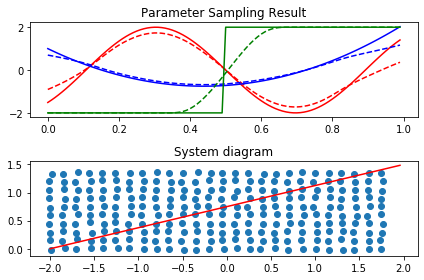
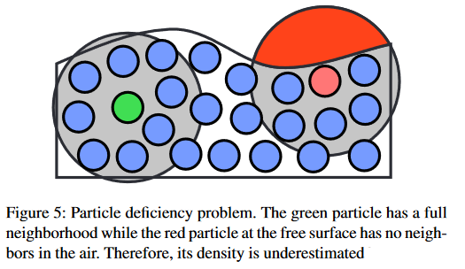
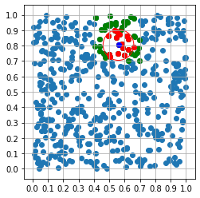

# smooth-particle-hydrodynamics
Sophisticated fluid simulation experiments

I have been trying to implement a satisfactory fluid simulation for quite a long time now.
All of my homebrew ideas have failed, and I happen to be doing a Fluid Dynamics course at uni at the moment, so I figured I had a good excuse to delve into the quite technical field of professional high-level fluid simulation.

The technique I am learning is called "Smoothed-Particle Hydrodynamics", or SPH for short.

What is it?
-----
The key concept behind SPH is the discretization of spatial field quantities and spatial differential operators,e.g., gradient, divergence, curl, etc.

In practice, it is the approximation of a field as the convolution of a set of points with a smooth kernel function to produce efficient and stable models.
//To Do: Explain some of the maths behind this further...

Discretization Test
----
Before I launched into the project full throttle, I wanted to check my theoretical understanding was valid. To this end, I wrote a very inefficient and crude prototype script to test how the approximation would work for a known function.

The solid lines plotted on the top diagram are the z-values of a 2D analytic function along the parameterized red line through space shown on the bottom diagram. The dashed lines plotted on the top diagram are the corresponding approximations found by convolving the blue points (bottom graph) with a *cubic spline kernel*.

We can draw a few conclusions from this:
 1. The approximation seems to function broadly well
 2. The approximation struggles with rapidly changing functions (eg: the green step function)
 3. The approximation undervalues peaks in functions
 4. The approximation fails at boundaries

The 4th problem is caused by the fact that SPH relies on a "neighbourhood" of local particles to sum over, and once you get to the end of the region, the particles on the edge of the system no longer have a full neighbourhood, and so the approximation breaks down.

Fast Neighbourhood Search Test
---
The compact support of the kernel function ensures that instead of summing over all particles, only particles within the kernel support radius (h) need be considered. A cruicial technology to allow this to be leveraged is a fast neighbourhood search, which here I have implemented as a memory inefficient (but quite fast) hash table. The sample space is split into a grid of "h" spacing, and only particles in the one-ring around a target point need be considered in the count. Some illustrations are below.

|:---:|:---:|:---|
|| |

Main algorithm implementation
----

W.I.P.
